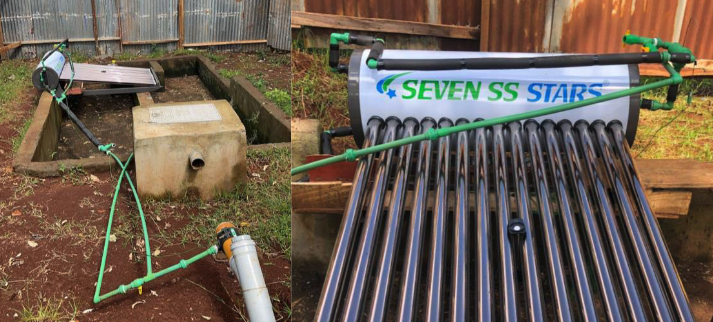

<!-- badges: start -->

<!-- badges: end -->

<h1> Solar Water Heater Modeling for Fecal Sludge Pasteurization </h1>

<b>Contributors</b>  
- Tim-Luan Grimont <a href="https://orcid.org/0009-0008-3289-8536">
 0009-0008-3289-8536
</a> *author*  
- Jakub Tkaczuk <a href="https://orcid.org/0000-0001-7997-9423">
 0000-0001-7997-9423
</a> *supervisor, developer, maintainer*  
- Elizabeth Tilley <a href="https://orcid.org/0000-0002-2095-9724">
 0000-0002-2095-9724
</a> *supervisor*  

 

 

  
This repository compliments the openly-accessible master’s thesis, available on the   
<a href="https://www.research-collection.ethz.ch/handle/20.500.11850/700054">ETH Research Collection</a>.

# Overview

This repository contains the python notebooks and the csv files used by Tim-Luan Grimont to complete his master thesis on 'Solar Pasteurization for Anaerobic Digestion Sludge' in 2024 at Global Health Engineering at ETH Zürich.

Solar pasteurization is a sanitation technology that utilizes solar energy to heat sludge beyond the survival threshold of pathogens. Effective pasteurization requires both high temperatures and sufficient holding time to eliminate microorganisms. This study explores the adaptation of an off-the-shelf solar water heater, available in Kenya, to pasteurize the post-anaerobic digester sludge, derived from human waste.

