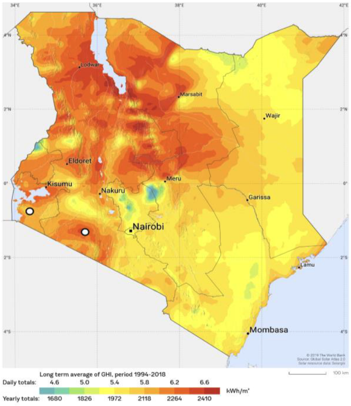

## `solar_measurements`

The solar radiation measurement data allows to simulate the pasteurizer operation in Narok and Homa Bay. This weather data is available thans to the World Bank Group for years 2020 and 2021.

The original dataset, description and headers can be found [here](https://energydata.info/dataset/kenya-solar-radiation-measurement-data). Download the following files from the above link and place them here:
- `Solar-Measurements_Kenya-Narok_World-Bank_Year1_QC.csv`
- `Solar-Measurements_Kenya-Narok_World-Bank_Year2_QC.csv`
- `Solar-Measurements_Kenya-Homa-Bay_Wold_Bank_Year1_QC.csv`
- `Solar-Measurements_Kenya-Homa-Bay_Wold_Bank_Year2_QC.csv`

The experimental part of this master's thesis took place in the Kiambu county, on the outskirts of Nairobi (in one of the coldest county in Kenya). The code from this repository allows to study the fasibility of setting up the pasteurizer in Homa Bay, where solar radiation is higher, yielding the conditions for pasteurization to be more advantageous. Data from Narok, allows to numerically compare the experimental data from this work and draw conclusions on the pasteurizer setup in Homa Bay (solar radiation in Narok is similar to the Kiambu county).

